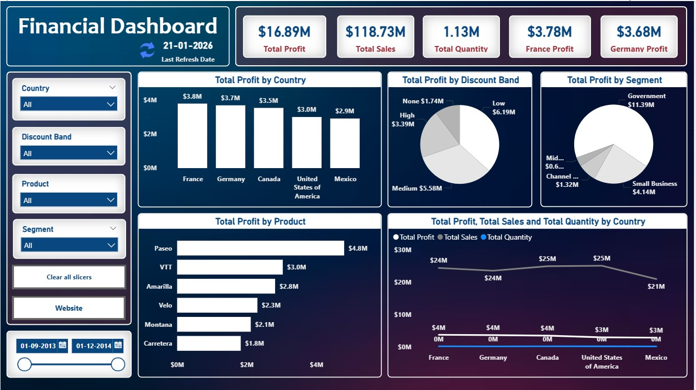

# 📊 Financial Analysis Dashboard

## 🔍 Objective
This project focuses on analyzing financial performance across countries, products, and customer segments to derive meaningful business insights.

---

## 📊 Tools & Technologies
- Power BI  
- Data Modeling  
- Data Visualization  

---

## 📁 Dataset Description
The dataset includes:
- Sales data  
- Profit metrics  
- Discount bands  
- Customer segments  
- Country-wise performance  

---

## 📈 Key Insights
- France and Germany generated the highest profits  
- Government segment contributed significantly to revenue  
- Discount strategies have a direct impact on profitability  
- Certain products outperform others in revenue generation  

---

## 🖼️ Dashboard Preview

---

## 💡 Skills Demonstrated
- Data cleaning and transformation  
- Building interactive dashboards  
- Business insight generation  
- KPI analysis  

---

## 🚀 Project Outcome
This dashboard helps in understanding financial trends and supports data-driven decision-making.
